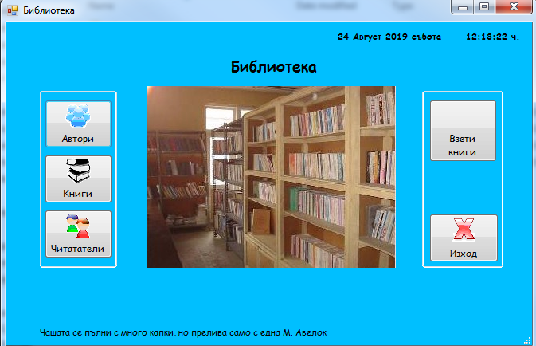
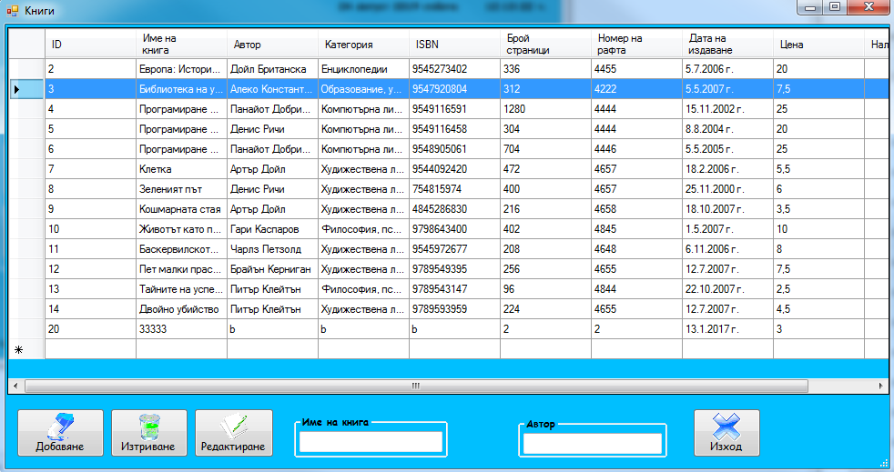

# GUI Bookstore 
Written in C# using Visual Studio and used Microsoft Access for database. 
Functionalities include login, taking books, searching, adding and updating books and autors, identity authentication.

## Screenshots

Username: admin

Password: admin

## Running the project
- Import the project in Visual Studio Click Build and Run
